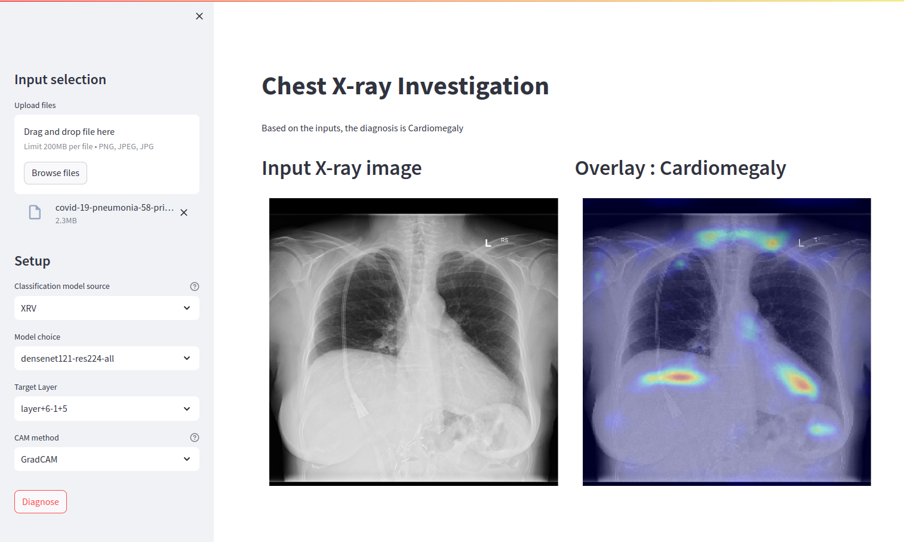

# Chest X-Ray Investigation
## Reference
[TorchXRayVision](https://github.com/mlmed/torchxrayvision)
[TorchCAM](https://github.com/frgfm/torch-cam)

## Steps for using docker
```sh
docker build -f Dockerfile -t chest-xray .
docker run -p 8501:8501 chest-xray
```

## Preview

